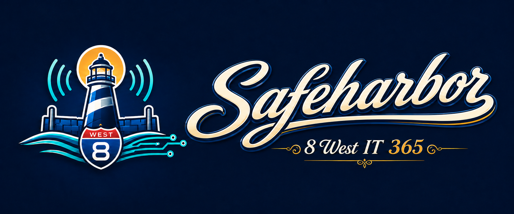

  

# Safeharbor

**Every client issue, safely ashore.** Safeharbor is the help desk for the
[8 West IT 365 suite](https://8westit.com/), built by 8 West IT, LLC. It gives
technicians a place to manage client requests, conversations, service goals,
approved time, and reports. It works alongside Milepost for device and alert
context, Coastmark for draft invoice lines, and 8 West ID for suite sign-in.

**Current state (September 24, 2026):** The service is live at
[safeharbor.8westit.com](https://safeharbor.8westit.com/). The core desk is
feature-complete, while the four-week dogfood gate for the v1.0 stamp remains
open. Managed onboarding is enabled for eligible new MSP signups; the first real
new-MSP customer journey is still unproved. See the
[current operating status](docs/where-things-stand.md) and
[IT 365 stopping point](docs/IT_365_STOPPING_POINT_2026_09_24.md) for the exact
scope and verification evidence.

## What Safeharbor does

- **Handle support requests:** A technician queue, ticket conversations,
  internal notes, saved replies, attachments, search, and customer feedback.
  Milepost alerts and supported suite apps can also create scoped tickets.
- **Track service and work:** Versioned first-response service goals, technician
  time with human approval and correction history, and operational reports.
- **Give customers a place to follow up:** The approved Lifestyle customer
  portal supports new requests, replies, ticket details, and report archives.
  Broader customer acceptance remains a separate step.
  The [Phase 1 portal update](docs/customer-portal-phase1.md) adds a private Westy
  conversation and explicitly reviewed ticket handoff. It remains under review;
  production AI activation and real-provider acceptance are separate gates.
- **Connect the suite carefully:** Approved time can be sent to an existing
  Coastmark connection as a *draft* invoice line. Coastmark owns pricing and
  every later invoice decision. Westy offers help and guidance; it does not
  approve time or send invoices.

## Access and repository guide

Safeharbor requires an authorized account; the live app is not a public demo.
For product inquiries, visit [8 West IT](https://8westit.com/).

| Location | Purpose |
|---|---|
| [app/](app/) | PHP application; start with the [app guide](app/README.md) |
| [brand/](brand/) | Approved logos and [brand usage guide](brand/README.md) |
| [docs/](docs/) | Current status, product contracts, and release evidence |
| [deploy/](deploy/) | Operator [deployment runbook](deploy/README.md) |

The application uses PHP 8.3, MySQL, Apache, and plain JavaScript; there is no
frontend build step. Authorized contributors should read
[AGENTS.md](AGENTS.md) and the current status before making changes. The
deployment runbook owns release and rollback steps.
